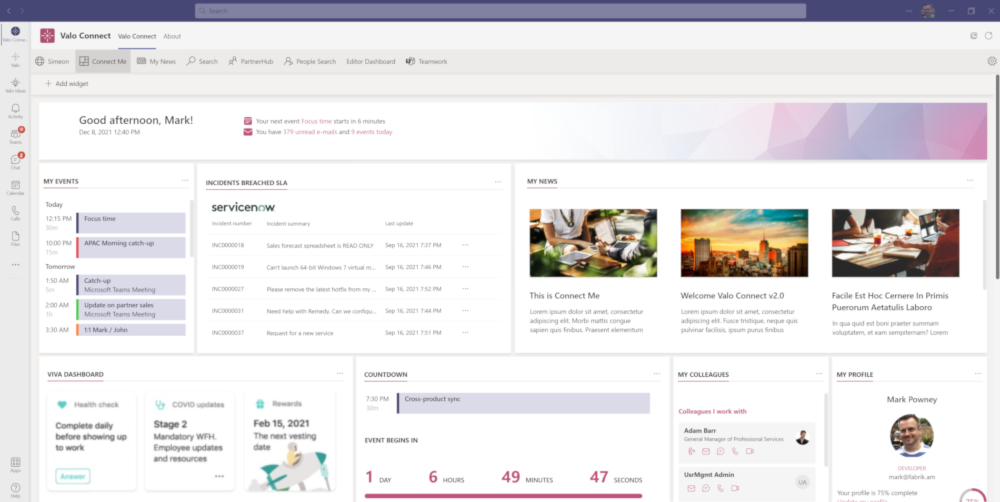

# valo-connect-integration-samples

## Summary

This solution is an example for the [Valo Connect] widgets extensibility framework. When this  SharePoint Framework solution is added to a Valo Connect customer's environment, two new widgets will be available:

* ServiceNow - View Incidents breached SLA inside Microsoft Teams
* Xero - Open your payslip inside Microsoft Teams

Combined with the sample [valo-connect-integration-proxy](https://github.com/ValoIntranet/valo-connect-integration-proxy) Azure Function solution, customers and partners can reference the approach outlined in these solutions to build a custom widget that integrates with third-party software applications with OAUTH2 capable authentication platforms, and presents data from the third-party applications in to the Connect Me / Microsoft Teams personal dashboard.

## Used SharePoint Framework Version

## Applies to

- [SharePoint Framework](https://aka.ms/spfx)
- [Microsoft 365 tenant](https://docs.microsoft.com/en-us/sharepoint/dev/spfx/set-up-your-developer-tenant)

> Get your own free development tenant by subscribing to [Microsoft 365 developer program](http://aka.ms/o365devprogram)

## Prerequisites

* This solution runs in a [Microsoft Teams](https://teams.microsoft.com) environment, part of the Microsoft 365 platform
* The solution an extension deployed on top of [Valo Connect](https://www.valosolutions.com/valo-connect). The Microsoft Teams environment must already have Valo Connect installed for this extension to work
* Valo partners can access more information on the deployment steps of [Valo Connect extension packages here](https://docs.valosolutions.com/connect/extend/widgets/deploy/)

## Solution

Solution|Author(s)|Contact
--------|---------|-------
./src/extensions/connectMeServiceNow | Mark Powney, Product Owner at Valo Solutions (a Staffbase company)|Twitter: [@mpowney](https://twitter.com/mpowney)
./src/extensions/connectMeXero | Mark Powney, Product Owner at Valo Solutions (a Staffbase company)|Twitter: [@mpowney](https://twitter.com/mpowney)

## Version history

Version|Date|Comments
-------|----|--------
1.0.2|March 11, 2022|Updated README with descriptive information about this solution
1.0.1|August 17, 2021|Added Xero and ServiceNow extension widgets as samples
1.0.0|August 4, 2021|Initial release

## Disclaimer

**THIS CODE IS PROVIDED *AS IS* WITHOUT WARRANTY OF ANY KIND, EITHER EXPRESS OR IMPLIED, INCLUDING ANY IMPLIED WARRANTIES OF FITNESS FOR A PARTICULAR PURPOSE, MERCHANTABILITY, OR NON-INFRINGEMENT.**

---

## Minimal Path to Awesome

- Clone this repository
- Ensure that you are at the solution folder
- in the command-line run:
  - **npm install**
  - **gulp bundle --ship**
  - **gulp package-solution --ship**
- follow steps to deploy the bundled SPFx solution, documented [here](https://docs.valosolutions.com/connect/extend/widgets/deploy/)

## Features

Two widgets are made available to users of Valo Connect and Connect Me when this solution is deployed. Each widget implements the steps needed to authenticate to the respective third-party applications - ServiceNow, and Xero. 

This extension illustrates the following concepts:

- obtaining an authentication token from:
  - ServiceNow authentication platform
  - Xero authentication platform
- managing authentication tokens in Microsoft Teams, e.g. long-life refresh tokens from ServiceNow, and silently refreshing access tokens
- integrating Microsoft Teams with a custom Azure Function app to make an auth token available inside Microsoft Teams

## References

- [Getting started with SharePoint Framework](https://docs.microsoft.com/en-us/sharepoint/dev/spfx/set-up-your-developer-tenant)
- [Building for Microsoft teams](https://docs.microsoft.com/en-us/sharepoint/dev/spfx/build-for-teams-overview)
- [Use Microsoft Graph in your solution](https://docs.microsoft.com/en-us/sharepoint/dev/spfx/web-parts/get-started/using-microsoft-graph-apis)
- [Publish SharePoint Framework applications to the Marketplace](https://docs.microsoft.com/en-us/sharepoint/dev/spfx/publish-to-marketplace-overview)
- [Microsoft 365 Patterns and Practices](https://aka.ms/m365pnp) - Guidance, tooling, samples and open-source controls for your Microsoft 365 development